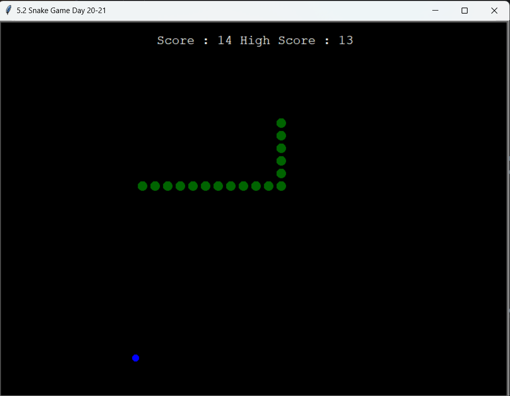

# 🐍 Snake Game in Python (Turtle Graphics)

A classic Snake game built using Python's `turtle` module.

The player controls the snake using arrow keys, eats food to grow longer, and avoids colliding with itself.

---

## 🎮 Controls

- ⬆ Up Arrow – Move Up
- ⬇ Down Arrow – Move Down
- ⬅ Left Arrow – Move Left
- ➡ Right Arrow – Move Right
- Space – Pause / Resume
- V – Restart after Game Over

---

## 🚀 Features

- Smooth snake movement
- Score tracking
- Food spawning system
- Border wrap logic
- Self-collision detection
- Modular OOP design

---

## 🛠️ Technologies Used

- Python 3.11
- turtle
- time
- Object-Oriented Programming
- Docker (containerization practice)

---

## 📂 Project Structure
```bash
snake-game/
│
├── main.py
├── snake.py
├── food.py
├── scoreboard.py
├── requirements.txt
├── Dockerfile
├── docker-compose.yml
└── README.md
```

---

## ▶️ Run Locally (Recommended)

```bash
git clone https://github.com/Fayyaz6137/Snake-Game-in-Python.git
cd snake-game
pip install -r requirements.txt
python main.py
```

---

## 🐳 Run With Docker

```bash
docker compose up --build
```
⚠️ Since this is a GUI application, running inside Docker requires an X server (e.g., VcXsrv on Windows).

---

## 🖼️ Game Screenshot


